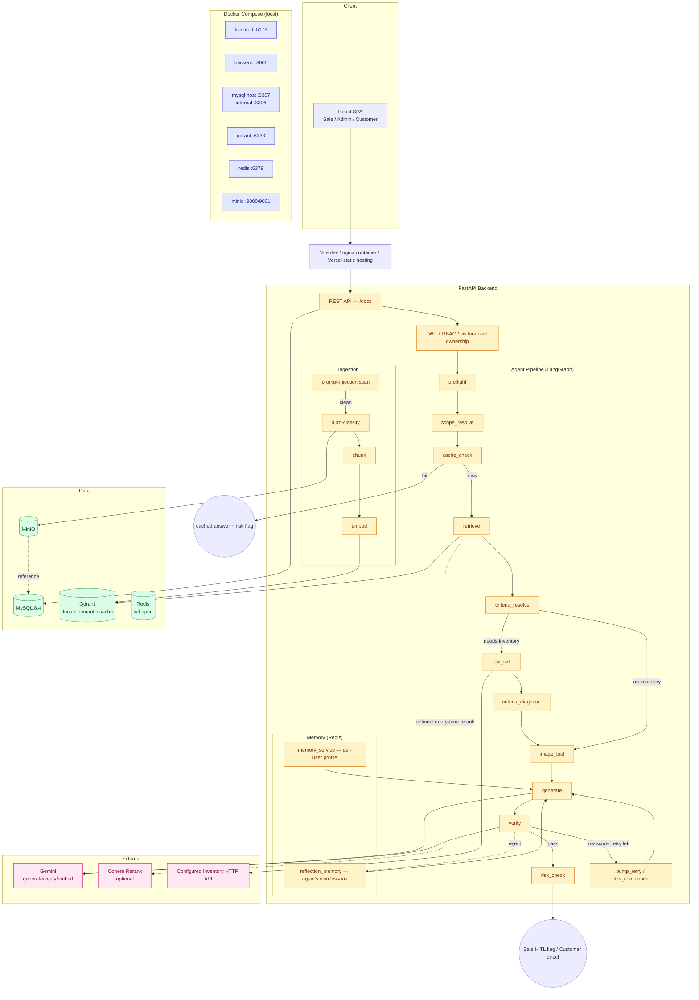
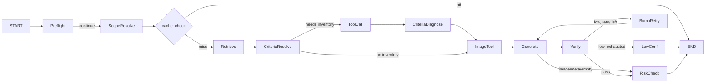
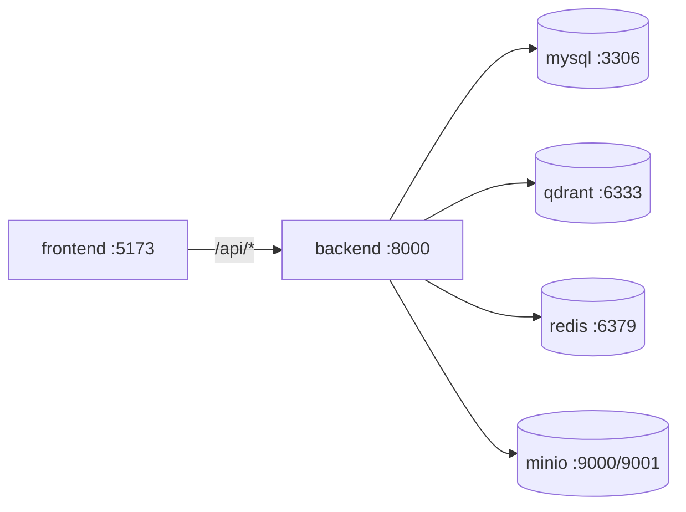

# Architecture

## Overview

One React SPA with public routes and JWT-protected Sale / Admin / Customer routes. Anonymous customer chat uses a visitor token. One FastAPI backend orchestrates a LangGraph pipeline (preflight → scope → cache → retrieve → criteria → inventory tool → image tool → generate → verify → risk-check). Four data stores: MySQL (relational), Qdrant (vectors + semantic cache), Redis (memory, fail-open), and MinIO (files). Docker Compose supports local development; `render.yaml` and `frontend/vercel.json` provide partial production hosting configuration whose external database, Qdrant, MinIO, domains, and secrets must still be supplied.

## Diagram

## Components

### Frontend
Single SPA with public landing, chat, catalogue, and news routes plus JWT role-gated Sale/Admin/Customer routes (`ProtectedRoute`). Sale: chat, HITL confirm card, feedback, inventory catalogue, live-inbox handoff. Customer: public/anonymous chat, quick-replies, and registration limits. Admin: document ingestion, eval dashboard, conflict resolution, sales management, billing requests, settings, and observability. State uses React Context + hooks — no Zustand/TanStack Query.

### Backend
FastAPI, RESTful, Swagger at `/docs`. JWT (HS256) with `role` claim (SALE/ADMIN/CUSTOMER); anonymous customers use a `visitor_token` instead. RBAC enforced at the route (`require_role`) and retrieval layer (Qdrant payload filter on `visibility`).

Routers: `auth`, `users`, `projects`, `documents`, `document_relations`, `sale_chat`, `customer_chat`, `sale_live`, `hitl`, `feedback`, `news`, `billing`, `admin_billing`, `admin_conflicts`, `admin_eval`, `admin_stats`, `admin_settings`, `admin_sales`, `admin_observability`, and `dev_seed` (dev-only).

### Customer chat & AI↔Sale handoff
Separate flow from Sale's own chat. Anonymous sessions use a `visitor_token`; logged-in customers use `customer_id`. Anonymous visitors have per-session turn and daily-question limits; both short-circuit before the pipeline runs. Registered customers also have a daily limit and can be handed off to a live Sale (`WAITING_SALE`) when handoff intent is detected. `sale_live.py` is the claim/reply/co-pilot inbox for that queue. Anonymous endpoints are rate-limited per IP in the backend process.

### Agent Pipeline (LangGraph)
One `StateGraph`, 13 nodes: `preflight → scope_resolve → cache_check → retrieve → criteria_resolve → tool_call → criteria_diagnose → image_tool → generate → verify → risk_check`, with `bump_retry`/`low_confidence` on the retry path.

- **preflight** — early exits (e.g. conversation-meta questions) before any retrieval.
- **scope_resolve** — resolves project/topic scope for the question.
- **cache_check** — semantic cache (Qdrant, normalized similarity ≥ 0.95); skipped when there is conversation history, a personalization profile, or active search criteria.
- **retrieve** — Qdrant search.
- **criteria_resolve** — resolves search criteria and inventory-need detection.
- **tool_call** — live inventory API; only reached when criteria_resolve determines inventory is needed.
- **criteria_diagnose** — diagnoses/annotates the tool_call result before images are attached.
- **image_tool** — runs *before* generate, so the model knows what photos will attach. Two strategies: uncapped when explicitly requested, capped at 3 with strict topic match when auto-attached.
- **generate** — answer + citations + suggested follow-ups (+ quick-replies for customers), one Gemini call. Reads memory profile and reflection lessons from Redis. A listing card whose area *and* price both carry no digit is dropped here (`_drop_figureless_listings`): the prompt tells the model to leave `listings` empty when the context has no figures, and the nightly answer-quality eval caught it inventing a placeholder card anyway on 5 of 6 runs of a plain policy question. Enforced in code rather than left to the prompt, so it cannot drift with the next prompt edit or model upgrade.
- **verify** — Faithfulness/Relevancy/Completeness (Gemini-as-judge). Rejections are distilled into a reflection lesson.
- **risk_check** — flags HITL for price/commitment content.
- **bump_retry / low_confidence** — one retry max, always carrying the Verifier's feedback (never a blind repeat); declines to "insufficient information" when still low.

Verify is skipped for image-only answers, conversation-meta questions, and empty-context openers — `risk_check` still runs in all three.

### Memory (Redis)
Two independent namespaces, both fail-open (Redis down → pipeline still answers, just without personalization):
- **Long-term** (`memory_service.py`) — per-user profile (unit types, budget, project, topics), extracted from the user's own questions only, never the model's answers. TTL 90 days.
- **Reflection** (`reflection_memory.py`) — lessons from the agent's own Verifier rejections, global by failure mode, keyword-matched. TTL 30 days.

`.env.example` currently omits `REDIS_URL`/`MEMORY_TTL_SECONDS` despite code defaults — should be added.

### Database (MySQL + Alembic)
Key tables: `users` (SALE/ADMIN/CUSTOMER share one table), `documents`, `projects`, `document_relations`, `conflict_flags`, `chat_sessions`, `messages`, `hitl_logs`, `feedback`, `audit_logs`, `leads`, `news_articles`, `customer_conversation_summaries`, observability tables, and billing/subscription tables.

`audit_logs` has **no foreign key on purpose**, so its rows outlive the user they describe — which makes anything personal written there undeletable by deleting the account. Free text bound for it goes through `audit.redact_and_truncate`, which strips Vietnamese mobile numbers, citizen IDs and emails (`backend/utils/pii.py`) before the row is written; plain `truncate` does not redact, because its other callers build the Sale's inbox preview where the customer's number is the point. The redactor is a backstop for free text, not a substitute for the rule at the top of `audit.py`: a contact detail passed as its own field is invisible to it, and names are deliberately not attempted (Vietnamese given names collide with ordinary words). Customer message text is stored unredacted in `messages` — that is the conversation itself, and `leads` stores the phone number deliberately, as the record the Sale calls back.

### Vector Store & Answer Images
Qdrant, two collections: main document store (dense, optional BM25 hybrid) and semantic cache. Embedding: `gemini-embedding-001` (768d), direct via `google-genai` — no LlamaIndex. Custom section-aware chunker.

Answer images (`answer_images_service.py`) — two strategies:
- **Requested** (e.g. "cho xem mặt bằng") — every matching photo, uncapped; falls back to the full gallery if nothing matches.
- **Auto-attached** (e.g. "tiện ích có gì") — capped at 3, strict topic match, no fallback.

### Ingestion
`sanitize_and_scan` (regex prompt-injection check) → `document_classification_service` → MinIO. By default every new upload stops after storing the original and the LLM metadata proposal. Admin approval/correction then triggers category-aware chunking → embedding → conflict scan → Qdrant publication. Pending and `other` documents are excluded again at retrieval as defense in depth. A confidence-based auto-approval path remains feature-configurable for trusted deployments but is disabled by the default approval gate.

### Eval
Four complementary layers, none replacing the others. They differ in what they can see: layers 1–3 never call a model, so they are cheap, deterministic and safe to gate a PR on; layer 4 is the only one that can tell whether the answer was any *good*, and it pays for that in API calls and variance.

1. **Tracing** (`backend/core/tracing.py`) — per-run JSONL trace, off by default. Content-free: it records `query_len`, not the question, which is why no judge can be run over traces after the fact.
2. **Graders** (`eval/graders.py`) — deterministic checks over recorded traces (grounded, tool called when needed, retry carries a correction, latency budget). `scripts/run_eval.py --fail-under RATE` can gate, but needs prior real traffic.
3. **Golden regression gate** (`eval/golden_dataset.py`, `tests/test_services/test_golden_regression.py`) — fixed Sale questions through the real pipeline with retrieval/inventory/LLM/Verifier stubbed. Deterministic, no API key, runs on every PR, catches routing/HITL/citation regressions.
4. **Answer quality** (`eval/deepeval_suite.py`, `.github/workflows/answer-quality.yml`) — the same golden questions with the **real model** drafting the answer, run nightly. Each case carries a hand-written `expected_output`, and the gates that decide pass/fail are rules, not opinions: `Required Facts` (the figures the reference commits to appear), `Forbidden Content` (no invented guarantee, no obeying an instruction planted in a document), `Listing Discipline` (no unit card invented to fill a slot). DeepEval's judged metrics — faithfulness, relevancy, correctness-vs-reference, no-invented-figures — sit alongside them and are read as a trend, because a judge on the same vendor as the answer model grades itself generously (`--judge-model` splits them, and also splits the per-model quota). The report separates the two into `deterministic_pass_rate` (the rules above — the number `--fail-under` gates on) and `judged_pass_rate` (the DeepEval metrics — trend only, flagged in the report and CLI output when the judge is not independent). `--repeats` scores each case over several attempts so a flaky case is distinguishable from a broken one.

`admin_eval.py` (`/admin/eval`) reads live Verifier scores from MySQL directly — not a DeepEval batch. DeepEval itself is offline-only, never in the request path, and `deepeval` is in `requirements-eval.txt` so it stays out of the production image.

## Data Flow
1. Sale/Customer sends a question.
2. JWT role authorization or anonymous visitor-token ownership check; anonymous customers also pass per-IP rate limiting, turn limits, and daily limits.
3. `preflight` — early exit for conversation-meta questions; `scope_resolve` resolves project/topic scope.
4. `cache_check` — semantic cache hit answers immediately; skipped with history, a personalization profile, or active search criteria.
5. `retrieve` — Qdrant search; `criteria_resolve` decides if live inventory is needed, then `tool_call` + `criteria_diagnose` if so.
6. `image_tool` — requested (uncapped) or auto-attached (capped at 3) photos.
7. `generate` — Gemini answer + citations + suggested questions (+ quick-replies), informed by memory + reflection lessons.
8. `verify` — score, one corrected retry max, decline if still low.
9. `risk_check` — sets the HITL flag for Sale answers. Customer self-service receives verified PUBLIC-tier answers directly and does not expose a HITL confirmation state.
10. Response returned; Verifier scores written to MySQL for the Admin dashboard; rejections feed reflection memory.

## Deployment

### Local — Docker Compose

### Hosted configuration

`render.yaml` defines the backend and Redis service on Render, while `frontend/vercel.json` supplies the SPA rewrite for Vercel. MySQL, Qdrant, MinIO, frontend build-time API URLs, domains, and production secrets remain external configuration. CI validates code quality and tests but does not perform deployment.

## Security
- Local secrets use `.env`; hosted secrets are supplied as environment variables and are not committed.
- Pydantic validation on every endpoint.
- CORS via `cors_origins`.
- RBAC: route-level (`require_role`) + retrieval-level (Qdrant `visibility` filter).
- Prompt-injection scanning blocks unsafe uploads before object storage and vectorization.
- HITL is mandatory for price/commitment answers in the Sale co-pilot. Customer self-service receives verified PUBLIC-tier answers directly with `requires_hitl=false`.
- Rate limiting: per-IP, anonymous customer endpoints only — not applied API-wide.
- Redis-backed personalization, reflection memory, and search criteria fail open when Redis is unavailable.

## Design Decisions

| Decision | Choice | Reason |
|---|---|---|
| Orchestration | LangGraph `StateGraph`, 1 graph | Simpler than multiple agents for a retry loop |
| Database | MySQL + Alembic | Clear relations for Admin dashboard joins |
| Frontend | React + Vite, 1 SPA, no SSR | Internal tool, auth-gated; role-branching beats multiple apps |
| Vector store | Qdrant | Self-hosted, payload filtering for RBAC, doubles as semantic cache |
| Memory | Redis, fail-open | Personalization is a nice-to-have, not a source of truth |
| Embedding | `gemini-embedding-001` direct | Same ecosystem as generation, no LlamaIndex needed |
| Generation/Verify | Configurable Gemini model; default `gemini-3.5-flash-lite` | Shared structured-output client for drafting and verification |
| Retrieval | Dense + optional BM25/Cohere rerank, fail-open to heuristic | Code defaults are off; `.env.example` enables both optional stages |
| Eval | Live scores + trace/graders + golden regression + nightly answer quality | Dashboard monitoring, real-traffic detection, pre-merge routing regression, and model-quality trends |
| Customer chat | Separate PUBLIC-clearance flow with no customer-facing HITL state | Registered customers can explicitly hand off to a Sale; self-service answers remain direct |
| Inventory | Mock API via env var | No real internal API yet; swap is a config change |
| Deploy | Docker Compose locally; partial Render/Vercel configuration | Hosted dependencies and production environment values remain externally managed |
