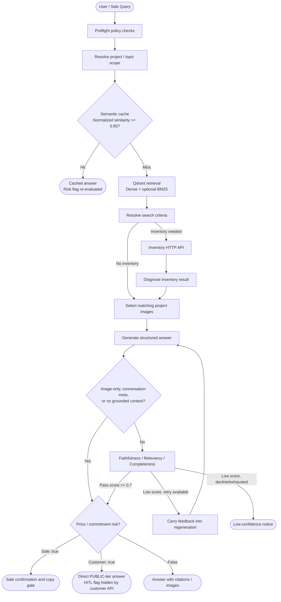

<div align="center">


### **AUREMONT AI AGENT**
**Real-Estate AI Sales & Consultation Platform**

*Grounded RAG • Real-Time Inventory HTTP Tool • Self-Reflecting Verifier • Deterministic Human-in-the-Loop Risk Gate*

---

[](https://www.python.org/)
[](https://fastapi.tiangolo.com/)
[](https://react.dev/)
[](https://langchain-ai.github.io/langgraph/)
[](https://qdrant.tech/)
[](https://redis.io/)
[](https://www.mysql.com/)
[](https://www.docker.com/)

</div>

---

> **Note:** This repository is a copy of VinAI20K.
> **Live Demo:** https://p110-frontend.vercel.app/

---

## 📌 Executive Overview

### The Real Estate Sales Challenge
Real-estate sales professionals and customer support agents face a high-stakes, fast-paced environment:
- **Massive, Fragmented Knowledge Base**: Hundreds of pages of project prospectuses, complex payment schedules, zoning legalities, and shifting discount policies across multiple documents (PDF, DOCX, XLSX).
- **High Consequence of Error**: Quoting an inaccurate price, invalid discount percentage, or outdated payment milestone can lead directly to contract disputes, brand damage, and financial liability.
- **Dynamic Inventory Churn**: Unit availability changes second-by-second on live internal databases — static RAG answers risk quoting units that are already reserved or sold.
- **Latency vs. Accuracy Tradeoff**: Sales reps in the field need responsive, grounded answers while consulting clients live.

### The Auremont Solution
**Auremont** is an AI assistant designed specifically for real-estate sales enablement and customer consultation. Built on a stateful **LangGraph** orchestration graph, Auremont combines semantic retrieval with real-time tool execution, a second-pass LLM verifier with self-reflection, and a deterministic **Human-in-the-Loop (HITL)** risk gate for Sale answers.

---

## 🏗 System Architecture & Pipeline

Auremont implements one stateful **LangGraph StateGraph**:



---

## 🌟 Key Capabilities & Technical Highlights

### 1. 🛡️ Second-Pass Verification & Reflexion Self-Correction Loop
- **Second-Pass Judge**: Eligible generated drafts are evaluated in a separate verifier call scoring three dimensions: **Faithfulness** (grounded in context), **Answer Relevancy** (answers what was asked), and **Completeness** (covers all sub-questions). Image-only, conversation-meta, and empty-context answers may skip this call.
- **Reflexion Retries (`MAX_GENERATE_RETRIES=1`)**: When a draft scores below threshold ($\tau = 0.7$), the Verifier's exact diagnosis (e.g., `"thiếu tiến độ đợt 2"`) is fed back into the prompt for a targeted, corrected re-generation.
- **Reflection Memory**: Defect patterns are distilled and stored in Redis (`reflection:lessons`) to inoculate future sessions against repeating identical mistakes.

### 2. ⚡ Deterministic Human-in-the-Loop (HITL) Safety Gate
- **Conservative Regex Risk Classifier**: Evaluates answers with zero LLM overhead for financial units (`tỷ`, `triệu`, `VND`), raw numbers ($\ge 9$ digits), percentages, and commitment phrasing such as `đặt cọc`, `cam kết`, `hợp đồng`, and `sổ hồng`.
- **Sale Confirmation Flow**: When `requires_hitl = True`, the answer is shown in a warning card. The sales rep must review and click **Confirm** before using the card's copy action.

### 3. 🛠️ Live Inventory HTTP Tool
- Real-time stock queries (`"Còn căn 2PN nào không?"`) are routed by the pipeline to an HTTP inventory API rather than answered from static vector embeddings.
- **Configurable Slug Mapping**: `INVENTORY_PROJECT_MAP` optionally maps catalogue slugs to inventory API project codes using comma-separated `slug=code` entries and an optional `*=code` fallback.

### 4. 🚀 Optional Hybrid Retrieval & Verifier Bypass
- **Dense + Optional Sparse Search**: When enabled, combines semantic embeddings with local BM25 keyword matching (FastEmbed) via Reciprocal Rank Fusion (RRF).
- **Semantic Cache (`salesmate_qa_cache`)**: Eligible opening questions can reuse a verified answer when the normalized similarity reaches `0.95`. Cache lookup still creates a query embedding, but skips retrieval, generation, and verification on a hit.
- **Verifier Bypass**: Explicit image requests, conversation-meta questions, and answers without grounded retrieval/inventory/catalog context can skip the secondary Verifier call; `risk_check` still runs.

### 5. 👥 Dual-Audience RBAC & Document Visibility Quarantine
- **Role-Based Clearances**:
  - `INTERNAL`: Sales reps and Admins can query internal pricing policies, commission sheets, and unreleased documents.
  - `PUBLIC`: Customer chat strictly filters retrieval to public marketing material; answers are formulated in a polite, discovery-focused consultative tone.
- **Automated Anti-Injection & Ingestion Scanner**: Parses PDF and DOCX uploads, scans extracted text for prompt-injection patterns, and quarantines exact duplicate content before publication.

---

## 🛠️ Technology Stack

| Layer | Technology | Purpose |
| :--- | :--- | :--- |
| **Backend Core** | FastAPI • Python 3.11 • Pydantic v2 | Async REST API, validation, dependency injection |
| **Orchestration** | LangGraph (`StateGraph`) | Stateful cyclic workflow with conditional branching |
| **LLM & Embeddings** | Google Gemini (`gemini-3.5-flash-lite`, `gemini-embedding-001`) | Fast reasoning, structured JSON outputs, high-dimensional vector embeddings |
| **Reranking** | Cohere Rerank v3.5 *(optional hosted cross-encoder)* | Context ranking followed by local duplicate removal |
| **Vector DB** | Qdrant | Dense vector search, optional BM25 sparse vectors, semantic QA cache |
| **Relational DB** | MySQL 8.4 LTS • SQLAlchemy 2.0 • Alembic | Structured relational storage (users, sessions, messages, audit logs) |
| **Memory & Cache** | Redis 7 Alpine *(AOF persistence, fail-open)* | Long-term user preferences, Reflection Memory, search criteria |
| **Object Storage** | MinIO (S3-compatible) | Secure document storage, project image CDN caching |
| **Frontend SPA** | React 19 • Vite • TypeScript • CSS • Internal SVG icon components | Responsive UI with Sale, Admin, and Public Customer modes |
| **Evaluation** | Custom Graders • Golden Regression Dataset • DeepEval • Pytest | Continuous quality evaluation, latency benchmarking, hallucination tracking |

---

## 🌐 Infrastructure & Ports

Production probes and observability are exposed at `/health/live`, `/health/ready`, and `/metrics`. Reliability
targets, PromQL examples, and the error-budget policy are defined in [SLO.md](SLO.md).

| Service | Container / Service | Port (Host) | Internal URL | Purpose |
| :--- | :--- | :--- | :--- | :--- |
| **Backend** | `ai20k_backend` | `8000` | `http://backend:8000` | REST API, OpenAPI docs (`/docs`) |
| **Frontend** | `ai20k_frontend` | `5173` | `http://frontend:80` | React 19 Client UI |
| **MySQL** | `ai20k_mysql` | `3307` | `mysql:3306` inside Docker | Relational Database |
| **Qdrant** | `ai20k_qdrant` | `6333` | `http://qdrant:6333` | Vector Database & Semantic Cache |
| **Redis** | `ai20k_redis` | `6379` | `redis://redis:6379/0` | Memory & Lesson Storage |
| **MinIO API** | `ai20k_minio` | `9000` | `http://minio:9000` | S3 Object Storage API |
| **MinIO Console** | `ai20k_minio` | `9001` | `http://minio:9001` | MinIO Web Management Console |

---

## 🚀 Quick Start Guide

### Prerequisites
- [Docker Desktop](https://www.docker.com/products/docker-desktop/) (recommended for full-stack deployment)
- Node.js 20.19+ and Python 3.11+ (when running the application processes locally)
- A valid [Google Gemini API Key](https://aistudio.google.com/)

### 1. Clone & Configure
```bash
# Clone the repository
git clone https://github.com/AI20K-Build-Phase-Cohort-3/P-110.git
cd P-110

# Configure environment files
cp .env.example .env
cp frontend/.env.example frontend/.env
```

Open `.env` and fill in your keys:
```env
GEMINI_API_KEY=your_actual_gemini_api_key_here
SECRET_KEY=generate_a_secure_random_key_for_production
```

### 2. Launch with Docker Compose (Recommended)
```bash
# Start all 6 containerized services
docker compose up -d --build
```
> Database migrations, schema seeding, and default demo accounts are automatically applied on startup!

- **Sale / Customer App**: `http://localhost:5173`
- **Swagger API Docs**: `http://localhost:8000/docs`
- **Default Accounts**:
  - **Sale User**: `sale_test` / `pass1234`
  - **Admin User**: `admin_test` / `pass1234`

### 3. Local Application Processes with Local Infrastructure
```bash
# 1. Start the required local data services
docker compose up -d qdrant redis minio

# 2. Setup Python Virtual Environment
python -m venv .venv
.venv\Scripts\activate      # On Windows
# source .venv/bin/activate # On Linux/macOS

# 3. Install dependencies
pip install -r requirements.txt

# 4. Create the SQLite directory and apply database migrations
mkdir data
alembic upgrade head

# 5. Start backend server
uvicorn backend.main:app --reload --port 8000

# 6. Start frontend (in a separate terminal)
cd frontend
npm ci
npm run dev
```

---

## 📂 Repository Structure

```text
P-110/
├── assets/                    # Project logos
├── backend/
│   ├── ai/                    # Prompt engineering, citations, intent classification
│   ├── core/                  # Configuration, database engines, security, rate limiting
│   ├── middleware/            # Request logging and Prometheus metrics
│   ├── models/                # SQLAlchemy ORM models (User, Session, Message, Audit)
│   ├── schemas/               # Pydantic schemas for request/response serialization
│   ├── repositories/          # Abstracted data-access layer (Session, Message, Document)
│   ├── services/              # Core business services:
│   │   ├── agent_pipeline.py  # LangGraph Multi-Agent Orchestrator
│   │   ├── verifier_service.py# Independent 3-axis LLM judge & feedback generator
│   │   ├── risk_service.py    # Deterministic price & commitment detector
│   │   ├── rag_service.py     # Hybrid retrieval, context selection, chunking
│   │   ├── cache_service.py   # Semantic QA vector cache in Qdrant
│   │   ├── reflection_memory.py # Self-correction lesson storage in Redis
│   │   └── inventory_service.py # Live stock API client with slug mapping
│   ├── routers/               # FastAPI route controllers (Auth, Sale, Customer, Admin, HITL)
│   ├── utils/                 # Shared helpers (text, time, phone, PII, VND)
│   └── main.py                # Application entrypoint and lifespan management
├── frontend/                  # React 19 + Vite SPA (Sale, Admin, Customer interfaces)
├── migrations/                # Alembic database schema migrations
├── eval/                      # Evaluation suite, golden dataset, LLM grading runners
├── tests/                     # 1,400+ automated unit, integration, and regression tests
├── docs/                      # Comprehensive developer guides, conflict resolution specs
└── docker-compose.yml         # Local 6-service development stack
```

---

## 🧪 Testing & Quality Assurance

Auremont maintains strict test coverage across all critical pipeline components:

```bash
# Run unit & service tests (no Docker needed, mocked dependencies)
pytest tests/test_services tests/test_api -v

# Run inventory & reflexion verification tests specifically
pytest tests/test_services/test_inventory_service.py tests/test_services/test_agent_pipeline_reflexion.py -v

# Run full golden regression gate
pytest tests/test_services/test_golden_regression.py -v

# Run nightly answer-quality eval against the real model (requires GEMINI_API_KEY,
# pip install -r requirements-eval.txt)
python -m eval.deepeval_suite --judge-model gemini-3.1-pro-preview --repeats 3

# Run the same backend quality checks as CI
ruff check backend tests eval
ruff format --check backend tests eval
mypy backend
```

---

## 🤝 Contributing

Setup, the four checks CI runs, and the parts of the pipeline that need care are in
[CONTRIBUTING.md](CONTRIBUTING.md). Security policy and secret handling are in
[SECURITY.md](SECURITY.md).

---

## 👤 Team

Developed by **Team P-110**, Khóa 3 AI Thực Chiến:
- Nguyễn Quang Vinh (Team Lead)
- Hoàng Trường Giang
- Lê Thị Trúc Linh
- Đào Ngọc Duy

---

## 📄 License & Acknowledgments

This project is licensed under the [**MIT License**](LICENSE). Developed as part of the **AI20K Build Phase (Cohort 3)**. Special thanks to the instructors and mentors for technical guidance on multi-agent architectures and enterprise RAG standards.
